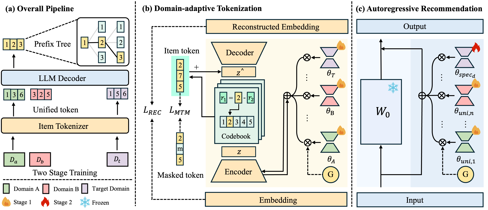

# From IDs to Semantics: A Generative Framework for Cross-Domain Recommendation with Adaptive Semantic Tokenization

## 1. Overview



Cross-domain recommendation (CDR) is crucial for improving recommendation accuracy and generalization, yet traditional methods are often hindered by the reliance on shared user/item IDs, which are unavailable in most real-world scenarios. Consequently, many efforts have focused on learning disentangled representations through multi-domain joint training to bridge the domain gaps.Recent Large Language Model (LLM)-based approaches show promise, they still face critical challenges, including: 1. **Item ID tokenization dilemma**: which leads to vocabulary explosion and fails to capture high-order collaborative knowledge; 2. **Insufficient domain-specific modeling**: for the complex evolution of user interests and item semantics. To address these limitations, we propose **GenCDR**, a novel **Gen**erative **C**ross-**D**omain **R**ecommendation framework. GenCDR first employs a **Domain-adaptive Tokenization** module, which generates disentangled semantic IDs for items by dynamically routing between a universal encoder and domain-specific adapters. Symmetrically, a **Cross-domain Autoregressive Recommendation** module models user preferences by fusing universal and domain-specific interests. Finally, a **Domain-aware Prefix-tree** enables efficient and accurate generation. Extensive experiments on multiple real-world datasets demonstrate that GenCDR significantly outperforms state-of-the-art baselines.

## 1.1 Model Architecture

### Domain-adaptive Tokenization
- Universal encoder for cross-domain knowledge
- Domain-specific adapters for specialized modeling
- Dynamic routing mechanism

### Cross-domain Autoregressive Recommendation
- Fuses universal and domain-specific interests
- Handles user preference evolution
- Maintains semantic consistency

### Domain-aware Prefix-tree
- Efficient generation strategy
- Accurate recommendation ranking


## 2 Quick Start

### 2.1 Python Environment

```
conda create --name gencdr python=3.10
conda activate gencdr
pip install -r requirements.txt
```

### 2.2 Data embedding

If using GPT-based APIs to assist tokenization or quantization, make sure to set your OpenAI API credentials.

Update `quantization/rqvae_config.yaml`:
```
openai_api_key: sk-xxxxxxxxxxxxxxxxxxxxxxxxxxxxxxxxxxxxxxxxxxxx
openai_base_url: https://
```
# 3. Training

### 3.1 RQ-VAE Training

```
python quantization_rqvae.py --datasets Clothing_Shoes_and_Jewelry Sports_and_Outdoors
```


### 3.2 Domain Adapter Tokenizer Training

```
python quantization_adapter.py \
    --config quantization/rqvae_config.yaml \
    --domain Sports_and_Outdoors \
    --general_model_path .pth
```

### 3.3 Cross-Domain Decoder Training & Domain Specific Decoder finetune

Please refer to [LlamaFactory](https://github.com/hiyouga/LlamaFactory).